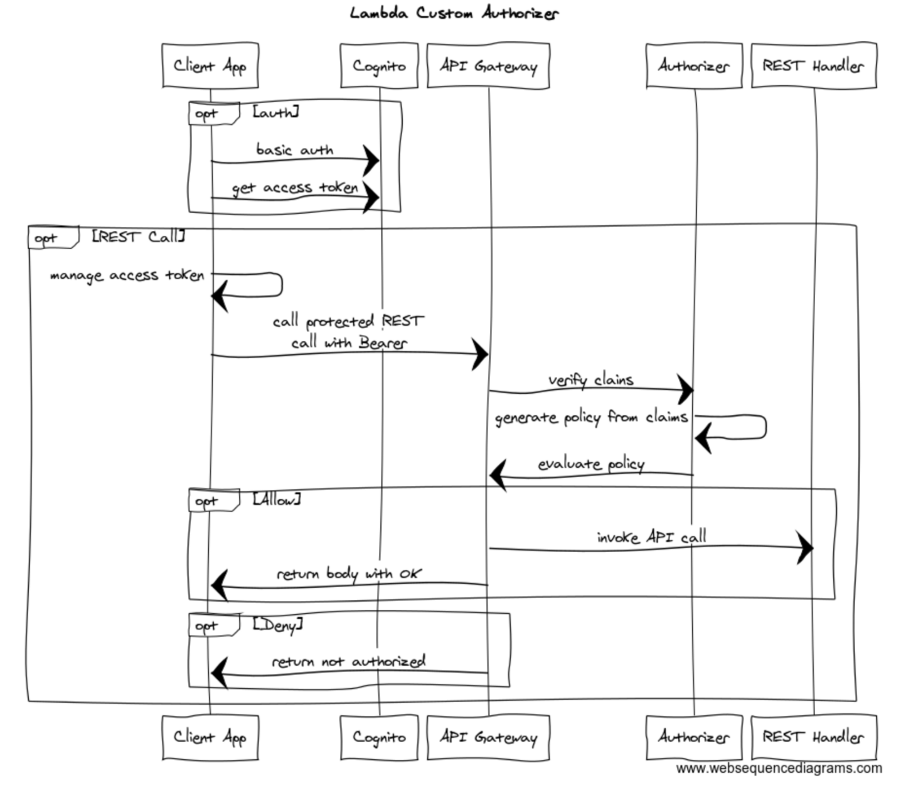

# API Gateway Custom Lambda Authorizer using Cognito, Python, and Serverless

Serverless is a pattern that helps developers build scalable APIs and to easily secure them. While serverless is incredible at creating a pattern that allows us to work in a more agile and atomic way, there are important as subtle things that make working with cryptography and authorization a little more difficult.

I really couldn't find a comprehensive example that fully explained how to create an authorizer for Cognito in Python 2.7 so this is intended to help developers who would like a complete example that explains how.

A few important considerations:

* When working with cryptography we will need to cross compile python native implementations so they can run on the Lambda
* Cognito JWT verification requires contacting the pool to obtain the required keys.
I have created a working example that solves for both of these issues as GitHub project.

## The Sequence


## The Ingredients
* Serverless — The automation framework for developing and deploying Cloud functions, this example deploys a python based Lambda in AWS. Requires node.
* Cognito — The AWS identity framework that allows user management automation.
* Python Jose — Python base JWT signing and verification.

## Requirements
```
pyyaml>=4.2b1
requests>=2.20.0
boto3==1.7.69
botocore==1.10.84
pytz==2018.7
timedelta==2018.11.20
python-jose-cryptodome==1.3.2
#only to run tests not needed for lambda
warrant==0.6.1
```

## Cross Compiling using A Docker Container in Serverless

If you believe that your code will rely on native libs, which crypto commonly does, you will want to use a docker container to compile your dependencies. That’s because the hasLambda is its own runtime, and in most cases, the shared lib from your local dev instance won't be compatible on a binary level.

```
service: serverless-cognito-api
plugins:
  - serverless-python-requirements
provider:
  name: aws
  runtime: python2.7
  region: us-east-1
  memorySize: 512
  iamRoleStatements:
    $ref: ./devIamRoleStatements.json
custom:
  pythonRequirements:
    dockerizePip: true
```    
## Verifying and Decoding Claims
The authorizer works by decoding the JWT using the Cognito public key and uses passing those claims along to generate a policy that either allows or disallows the request based on its path.

```
def get_claims(event, context):
token = event['authorizationToken'][7:]
    # get the kid from the headers prior to verification
    headers = jwt.get_unverified_headers(token)
    kid = headers['kid']
    # search for the kid in the downloaded public keys
    key_index = -1
    for i in range(len(keys)):
        if kid == keys[i]['kid']:
            key_index = i
            break
    if key_index == -1:
        print('Public key not found in jwks.json')
        return False
    # construct the public key
    public_key = jwk.construct(keys[key_index])
    # get the last two sections of the token,
    # message and signature (encoded in base64)
    message, encoded_signature = str(token).rsplit('.', 1)
    # decode the signature
    decoded_signature = base64url_decode(encoded_signature.encode('utf-8'))
    # verify the signature
    if not public_key.verify(message.encode("utf8"), decoded_signature):
        print('Signature verification failed')
        return False
print('Signature successfully verified')
    # since we passed the verification, we can now safely
    # use the unverified claims
    claims = jwt.get_unverified_claims(token)
    # additionally we can verify the token expiration
    if time.time() > claims['exp']:
        print('Token is expired')
        return False
# and the Audience  (use claims['client_id'] if verifying an access token)
    if 'aud' in claims and claims['aud'] != app_client_id:
        print('Token was not issued for this audience')
        return False
# now we can use the claims
    return claims
```

## The Authorizer
An authorizer is an intercepting lambda that is run on each call to the API with expects a bearer token to exist that can be verified, that the caller has the authority before it is allowed to happen. Its a great pattern for REST micro services because it allows the client to manage the authority and allows all called services do not need to manage state. If the client call has the token, its allowed.

AWS Labs has created a basic custom authorizer in Python, but it didn't have any integration with token verification for Cognito, so this brings it all together. This snippet requires some supporting classes to go to the full example here for the complete implementation.

```
def authorize(event, context):
    print("Client token: " + event['authorizationToken'])
    print("Method ARN: " + event['methodArn'])
    """validate the incoming token"""
    """and produce the principal user identifier associated with the token"""
"""this could be accomplished in a number of ways:"""
    """1. Call out to OAuth provider"""
    """2. Decode a JWT token inline"""
    """3. Lookup in a self-managed DB"""
    token = event['authorizationToken'][7:]
    unverified_claims = jwt.get_unverified_claims(token)
    print json.dumps(unverified_claims)
    principalId = jwt.get_unverified_claims(token).get('username')
"""you can send a 401 Unauthorized response to the client by failing like so:"""
    """raise Exception('Unauthorized')"""
"""if the token is valid, a policy must be generated which will allow or deny access to the client"""
"""if access is denied, the client will recieve a 403 Access Denied response"""
    """if access is allowed, API Gateway will proceed with the backend integration configured on the method that was called"""
"""this function must generate a policy that is associated with the recognized principal user identifier."""
    """depending on your use case, you might store policies in a DB, or generate them on the fly"""
"""keep in mind, the policy is cached for 5 minutes by default (TTL is configurable in the authorizer)"""
    """and will apply to subsequent calls to any method/resource in the RestApi"""
    """made with the same token"""
"""the example policy below denies access to all resources in the RestApi"""
tmp = event['methodArn'].split(':')
    apiGatewayArnTmp = tmp[5].split('/')
    awsAccountId = tmp[4]
policy = AuthPolicy(principalId, awsAccountId)
    policy.restApiId = apiGatewayArnTmp[0]
    policy.region = tmp[3]
    policy.stage = apiGatewayArnTmp[1]
try:
        print 'getting claims'
        #verified = verify_token(jwt_token,'access_token','access')
        claims = get_claims(event, context)
        print json.dumps(claims)
        if claims != False:
            print 'a'
            policy.allowAllMethods()
        else:
            policy.denyAllMethods()
except:
        policy.denyAllMethods()
"""policy.allowMethod(HttpVerb.GET, "/pets/*")"""
# Finally, build the policy
    authResponse = policy.build()
# new! -- add additional key-value pairs associated with the authenticated principal
    # these are made available by APIGW like so: $context.authorizer.<key>
    # additional context is cached
    context = {
        'key': 'value', # $context.authorizer.key -> value
        'number' : 1,
        'bool' : True
    }
    # context['arr'] = ['foo'] <- this is invalid, APIGW will not accept it
    # context['obj'] = {'foo':'bar'} <- also invalid
authResponse['context'] = context
return authResponse
```

## Generating JWTs for a User
It's important to be able test authorization as working, to accomplish this I wrote a JWT generator I could use to create access tokens for testing in postman.

This example uses Warrant, a convenience wrapper around boto3 cognito-dentity to auth the user and generates the token.

```
#get credentials for user
def authenticate_user(config, username, password):
u = Cognito(config['aws']['cognitio']['userPoolId'],
                config['aws']['cognitio']['userPoolClientId'],
                username=username)
    u.authenticate(password=password)
    user = u.get_user(attr_map={"given_name":"first_name","family_name":"last_name"})
print user.username, user.email_verified, u.access_token
return u.access_token
```

And the result:

```
$ python testauth.py foobar@gmail.com sooper34secret!
foobar@gmail.com True eyJraWQiOiJvQndJY0pCXC92Mzg3T31aK2ZGMVVETjNONlNGM3ZQQkg5eWl1VTMzbXdKdz0iLCJhbGciOiJSUzI1NiJ9.eyJzdWIiOiJlNzQzM2MwOC04NTdlLTQxNTEtOTg2Zi05MDVmMDQ4MTYzNmYiLCJkZXZpY2Vfa2V5IjoidXMtZWFzdC0xX2M0NmI1MGZlLWEyN2MtNDQwMS04M2ZiLTY0MjQzYTdlNjI1YyIsImV2ZW50X2lkIjoiYWQwODI5MTQtMWNjYy0xMWU5LWJiYTktNGI2MGIzMjg1NDE4IiwidG9rZW5fdXNlIjoiYWNjZXNzIiwic2NvcGUiOiJhd3MuY29nbml0by5zaWduaW4udXNlci5hZG1pbiIsImF1dGhfdGltZSI6MTU0ODAwMDEwMSwiaXNzIjoiaHR0cHM6XC9cL2NvZ25pdG8taWRwLnVzLWVhc3QtMS5hbWF6b25hd3MuY29tXC91cy1lYXN0LTFfUFarVTdya0VQIiwiZXhwIjoxNTQ4MDAzNzAxLCJpYXQiOjE1NDgwMDAxMDEsImp0aSI6Ijk0NWVjNzQwLTJmNTUtNGMwOC1hMjEyLWVjOWU4MTJjNzQ5NCIsImNsaWVudF9pZCI6IjUycXZwcTRnNGZyMzFoOXIwMmNmbmlqZjcxIiwidXNlcm5hbWUiOiJjbGF5dGFudG9yQGdtYWlsLmNvbSJ9.Qyc1XwUj28Kkb2mOj1t8YysP1fZHN-fL1ehLTKRcMYFzv847IjMfh-3revsRPp6fqiM45ds5eOLuo1V6r023My511ufDN0eEeVVsQwyTsJWkVMB0d4sD1zts_Yr8ObW91vK5__fowoIe3p3ox329UF5MycMoX7YWd3K5_LXP0hX6na-oXZ78MaYC8S6BMcLsEp4EEKAW4ISfijmOrSPX8wtrxBy2Qz8YRmZ_4XWKSHsqT5V-s2Fqk-MPYZKEgXDSxLPjwcKUVcUqryi7iqmeCkUF_OFNisP8DsYpw1YYH-_OblPDIbx0raod16zqSz23NgsB5dj3TaOk0ODrpSDxzg
Signature successfully verified

{"username": "foobar@gmail.com", "sub": "e7433c08-857e-4151-986f-905f0481636f", "device_key": "us-east-1_c46b50fe-a27c-4401-83fb-64243a7e625c", "token_use": "access", "iss": "https://cognito-idp.us-east-1.amazonaws.com/us-east-1_AUkU1rkEP", "event_id": "ad082914-1ccc-11e9-bba9-4b60b3285418", "jti": "945ec740-2f55-4c08-a212-ec9e812c7494", "exp": 1548003701, "auth_time": 1548000101, "client_id": "52qvpq4g4fr31h9r02cfnijf71", "scope": "aws.cognito.signin.user.admin", "iat": 1548000101}
```

## Conclusion
A custom authorizer is a powerful approach to building robust APIs using serverless patterns, but it is a pattern that requires a comprehensive approach to using effectively. This strategy has to also be integrated into CORS for S3 and CloudFront hosting to provide a complete solution that allows for both an AJAX and API strategy to be deployed without servers.

## install for python 2.7
```
virtualenv venv --system-site-packages
source venv/bin/activate
curl https://bootstrap.pypa.io/get-pip.py | python
pip install --upgrade pip
pip install -r requirements.txt
```

## serverless deploy dev
```
serverless deploy --stage dev --region us-east-1

serverless deploy function --function postMessage --region us-east-1 --stage dev

```
